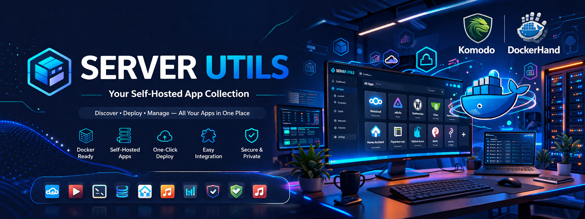

# ServerConfig

A collection of ready-to-deploy Docker Compose configurations for self-hosted applications. Each app is isolated with its own configuration, volumes, and network.

Point any Docker management tool — [Komodo](https://komo.do/), [Dockhand](https://github.com/fnsys/dockhand), [Portainer](https://www.portainer.io/), or [Homarr](https://homarr.dev/) — at the compose file and deploy.

## Apps

| App | Description | Default Port |
|-----|-------------|-------------|
| [Affine](docker_apps/affine) | Knowledge base and workspace (Notion alternative) | 3010 |
| [DDNS Updater](docker_apps/ddns-updater) | Dynamic DNS record updater | 8000 |
| [Dockhand](docker_apps/dockhand) | Docker container management | 3110 |
| [Drone](docker_apps/drone) | CI/CD platform | — |
| [Homarr](docker_apps/homarr) | Server dashboard with 40+ integrations | 7575 |
| [Homepage](docker_apps/homepage) | YAML-driven dashboard with Docker auto-discovery | 3310 |
| [Infisical](docker_apps/infisical) | Secrets management | — |
| [Jenkins](docker_apps/jenkins) | CI/CD pipeline | — |
| [Komodo](docker_apps/komodo) | Server and deployment management | 9120 |
| [Linkwarden](docker_apps/linkwarden) | Bookmark and link management | 38100 |
| [Memos](docker_apps/memos) | Lightweight note-taking | 5230 |
| [n8n](docker_apps/n8n) | Workflow automation | 5678 |
| [Nextcloud](docker_apps/nextcloud) | File storage and collaboration | 8285 |
| [Novu](docker_apps/novu) | Notification infrastructure for developers | 4400 |
| [ntfy](docker_apps/ntfy) | Push notifications | 8093 |
| [OneUptime](docker_apps/oneuptime) | Uptime monitoring and status pages | 3210 |
| [Portainer](docker_apps/portainer) | Docker management UI | — |
| [Rancher](docker_apps/rancher) | Kubernetes container management platform | 9443 |
| [Rocket.Chat](docker_apps/rocketchat) | Team communication | — |
| [SnapOtter](docker_apps/snapotter) | Self-hosted image processing with local AI | 1349 |
| [Trilium](docker_apps/trilium) | Personal knowledge base | — |

## Stacks

Pre-wired multi-app bundles (media servers + *arr automation, etc.) that spin up a full workflow in a single command. See [`docker_stacks/README.md`](docker_stacks/README.md) for the full list and conventions.

| Stack | Description | Default Port(s) |
|-------|-------------|-----------------|
| _Coming soon_ | | |

## Quick Start

```bash
cd docker_apps/memos
cp .env-example .env    # edit with your values
make memos-up
```

Or point your Docker management tool (Komodo, Dockhand, Portainer) at any `docker-compose.yml` and deploy directly.

## Per-App Commands

Every app has the same set of Make commands:

```
make <app>-up         # Start the app
make <app>-down       # Stop the app
make <app>-restart    # Restart the app
make <app>-logs       # Tail logs
make <app>-status     # Show container status
make <app>-shell      # Open a shell in the main container
make <app>-pull       # Pull latest images
make <app>-update     # Pull and restart
make <app>-clean      # Remove containers and volumes (with confirmation)
```

Run `make help` to see all available commands.

## Project Structure

```
ServerConfig/
├── Makefile                    # Root orchestration
├── docker_apps/
│   ├── <app>/
│   │   ├── docker-compose.yml  # Service definitions
│   │   ├── .env-example        # Template for environment variables
│   │   ├── .env                # Actual secrets (gitignored)
│   │   ├── Makefile            # App-specific commands
│   │   └── README.md           # Setup and notes
│   └── ...
└── scripts_utils/              # Utility scripts
```

## Adding a New App

1. Create `docker_apps/<app>/` with `docker-compose.yml`, `Makefile`, `.env-example`, and `README.md`
2. Follow the naming convention: containers as `<app>-<service>`, volumes as `<app>-<purpose>`, network as `<app>-network`
3. Keep all secrets in `.env` (never hardcode in compose files)
4. Add `include docker_apps/<app>/Makefile` and help entry to the root `Makefile`

Use `docker_apps/app_example/` as a template.

## Remote Deployment (Optional)

For rsync-based deployment to a remote server, configure `.env` at the project root:

```
REMOTE_USER=ubuntu
REMOTE_HOST=your-server-ip
SSH_KEY=~/.ssh/id_rsa
```

Then use `make push`, `make pull`, `make server-status`, and `make server-shell`.

## Security

- `.env` files are excluded from git — secrets never leave the local machine
- Each app runs in its own isolated Docker network
- No credentials are hardcoded in compose files

